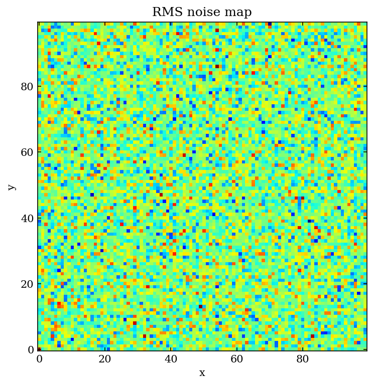

# Multiaxes

`Multiaxes` is a python class based on `matplotlib`.  
This script makes easy to draw a figure with multiple axes for the AASTeX manuscript.

## Install

```bash
pip install git+https://github.com/radioshiny/multiaxes.git
```

## Examples

### Getting started
The following is a basic example of plotting an image with the `Multiaxes`:
```python
import numpy as np
from multiaxes import Multiaxes

# make sample data
data = np.random.randn(10000).reshape((100, 100))

# make figure
mx = Multiaxes(col=1, nx=1, ny=1, xyr=1., xlab=0.3, ylab=0.4, tit=0.2, scale=0.7)
fig, ax, _ = mx.drawfig()
ax.set_xlabel('x')
ax.set_ylabel('y')
ax.set_title('RMS noise map')
ax.imshow(data, cmap='jet', origin='lower')
fig.savefig('images/rms.pdf')
```
<kbd></kbd>


* `col=1` (int) : figure width = width of one column in two column mode
* `nx=1` (int) : number of subplots in the horizontal direction
* `ny=1` (int) : number of subplots in the vertical direction
* `xyr=1.` (float) : x-length to y-length ratio of subplot
* `xlab=0.3` (float) : height of x-label in inch
* `ylab=0.4` (float) : width of y-label in inch
* `tit=0.2` (float) : height of title in inch
* `scale=0.7` (float) : zooming scale in LaTeX


In order for the figure to be inserted at the intended size (width) in your 
AASTeX manuscript, the `scale` parameter should be set to the same value used 
in `Multiaxes`. 
```latex
\begin{figure}
    \includegraphics[scale=0.7]{rms.pdf}
    \caption{The RMS noise map}
    \label{fig:rms}
\end{figure}
```

### Figure width

### Color bar

### Axes sharing


